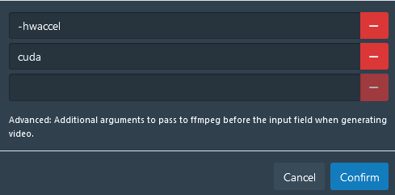
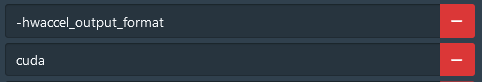
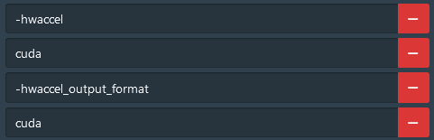
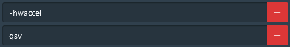

This fork is used to build docker images from the latest stash release. The image is based on the stash CUDA dockerfile (therefore no ARM support), with some modifications to replace ffmpeg with jellyfin-ffmpeg and include the required python dependencies for scrapers and plugins.

jellyfin-ffmpeg contains multiple patches and optimisations to enable full hardware transcoding and is more performant than the current implementation in stash.

To use HW acceleration in Stash ensure that it's enabled in the System>Transcoding settings and include the relevant ffmpeg args for your GPU. See the below example args for an Nvidia GPU.

As of writing this, it's only possible to choose between hardware decoding or hardware encoding with Nvidia GPUs due to the way stash builds the ffmpeg command.

Hopefully the stash team will fix this so that full hardware transcoding can be utilised with Nvidia GPUs.

### Nvidia Decoding



### Nvidia Encoding



### Nvidia Full Transcoding



### Intel Transcoding

Intel CPUs with an iGPU can utilise full hardware transcoding (decode and encode) with the below args.


***

# Stash

[](https://github.com/stashapp/stash/actions/workflows/build.yml)
[](https://hub.docker.com/r/stashapp/stash 'DockerHub')
[](https://github.com/sponsors/stashapp)
[](https://opencollective.com/stashapp)
[](https://goreportcard.com/report/github.com/stashapp/stash)
[](https://matrix.to/#/#stashapp:unredacted.org)
[](https://discord.gg/2TsNFKt)
[](https://github.com/stashapp/stash/releases/latest)
[](https://github.com/stashapp/stash/labels/bounty)

### **Stash is a self-hosted webapp written in Go which organizes and serves your porn.**


* Stash gathers information about videos in your collection from the internet, and is extensible through the use of community-built plugins for a large number of content producers and sites.
* Stash supports a wide variety of both video and image formats.
* You can tag videos and find them later.
* Stash provides statistics about performers, tags, studios and more.

You can [watch a SFW demo video](https://vimeo.com/545323354) to see it in action.

For further information you can consult the [documentation](https://docs.stashapp.cc) or [read the in-app manual](ui/v2.5/src/docs/en).

# Installing Stash

 Windows |  MacOS|  Linux |  Docker
:---:|:---:|:---:|:---:
[Latest Release](https://github.com/stashapp/stash/releases/latest/download/stash-win.exe) <br /> <sup><sub>[Development Preview](https://github.com/stashapp/stash/releases/download/latest_develop/stash-win.exe)</sub></sup> | [Latest Release (Apple Silicon)](https://github.com/stashapp/stash/releases/latest/download/stash-macos-applesilicon) <br /> <sup><sub>[Development Preview (Apple Silicon)](https://github.com/stashapp/stash/releases/download/latest_develop/stash-macos-applesilicon)</sub></sup> <br />[Latest Release (Intel)](https://github.com/stashapp/stash/releases/latest/download/stash-macos-intel) <br /> <sup><sub>[Development Preview (Intel)](https://github.com/stashapp/stash/releases/download/latest_develop/stash-macos-intel)</sub></sup> | [Latest Release (amd64)](https://github.com/stashapp/stash/releases/latest/download/stash-linux) <br /> <sup><sub>[Development Preview (amd64)](https://github.com/stashapp/stash/releases/download/latest_develop/stash-linux)</sub></sup> <br /> [More Architectures...](https://github.com/stashapp/stash/releases/latest) | [Instructions](docker/production/README.md) <br /> <sup><sub> [Sample docker-compose.yml](docker/production/docker-compose.yml)</sub></sup>

## First Run
#### Windows Users: Security Prompt
Running the app might present a security prompt since the binary isn't yet signed. Bypass this by clicking "more info" and then the "run anyway" button.
#### FFMPEG
Stash requires ffmpeg. If you don't have it installed, Stash will download a copy for you. It is recommended that Linux users install `ffmpeg` from their distro's package manager.

# Usage

## Quickstart Guide
Stash is a web-based application. Once the application is running, the interface is available (by default) from http://localhost:9999.

On first run, Stash will prompt you for some configuration options and media directories to index, called "Scanning" in Stash. After scanning, your media will be available for browsing, curating, editing, and tagging.

Stash can pull metadata (performers, tags, descriptions, studios, and more) directly from many sites through the use of [scrapers](https://github.com/stashapp/stash/tree/develop/ui/v2.5/src/docs/en/Scraping.md), which integrate directly into Stash.

Many community-maintained scrapers are available for download from [CommunityScrapers repository](https://github.com/stashapp/CommunityScrapers). The community also maintains StashDB, a crowd-sourced repository of scene, studio, and performer information, that can automatically identify much of a typical media collection. Inquire in the Discord for details. Identifying an entire collection will typically require a mix of multiple sources. 

<sub>[StashDB](http://stashdb.org) is the canonical instance of our open source metadata API, [stash-box](https://github.com/stashapp/stash-box).</sub>

# Translation
[](https://hosted.weblate.org/engage/stashapp/)
🇧🇷 🇨🇳 🇩🇰 🇳🇱 🇬🇧 🇪🇪 🇫🇮 🇫🇷 🇩🇪 🇮🇹 🇯🇵 🇰🇷 🇵🇱 🇷🇺 🇪🇸 🇸🇪 🇹🇼 🇹🇷

Stash is available in 25 languages (so far!) and it could be in your language too. We use Weblate to coordinate community translations. If you want to help us translate Stash into your language, you can make an account at [Stash's Weblate](https://hosted.weblate.org/projects/stashapp/stash/) to get started contributing new languages or improving existing ones. Thanks!

# Support (FAQ)

Check out our documentation on [Stash-Docs](https://docs.stashapp.cc) for information about the software, questions, guides, add-ons and more. 

For more help you can:
* Check the in-app documentation, in the top right corner of the app (it's also mirrored on [Stash-Docs](https://docs.stashapp.cc/in-app-manual))
* Join the [Matrix space](https://matrix.to/#/#stashapp:unredacted.org)
* Join the [Discord server](https://discord.gg/2TsNFKt), where the community can offer support.
* Start a [discussion on GitHub](https://github.com/stashapp/stash/discussions)

# Customization

## Themes and CSS Customization
There is a [directory of community-created themes](https://docs.stashapp.cc/user-interface-ui/themes) on Stash-Docs, along with instructions on how to install them.

You can also change the Stash interface to fit your desired style with various snippets from [Custom CSS snippets](https://docs.stashapp.cc/user-interface-ui/custom-css-snippets).

# For Developers

Pull requests are welcome! 

See [Development](docs/DEVELOPMENT.md) and [Contributing](docs/CONTRIBUTING.md) for information on working with the codebase, getting a local development setup, and contributing changes.

## Docker compose
Set up docker with compose for your distro.
Set up your nvidia gpu.

Install the libnvidia-container, nvidia-container and nvidia-docker packages.

Arch Linux with rootless-compose
```
yay -S libnvidia-container libnvidia-container-tools nvidia-container-toolkit nvidia-container-runtime nvidia-docker
mkdir stash
cd stash
sudo chown -R $USER:$USER .
vi docker-compose.yml
```
Use below docker-compose.yml template just fill in your paths.

```
docker compose up -d
```

Browse to localhost, go to settings, system under Transcoding add two FFmpeg Transcode Input Args
-hwaccel
cuda

```
# APPNICENAME=Stash
# APPDESCRIPTION=An organizer for your porn, written in Go
version: '3.4'
services:
  stash:
    image: nerethos/stash-jellyfin-ffmpeg:latest
    container_name: stash
    restart: unless-stopped
    ## the container's port must be the same with the STASH_PORT in the environment section
    #ports:
    #  - "80:9999"
    ## If you intend to use stash's DLNA functionality uncomment the below network mode and comment out the above ports section
    network_mode: host
    logging:
      driver: "json-file"
      options:
        max-file: "10"
        max-size: "2m"
    environment:
      - STASH_STASH=/data/
      - STASH_GENERATED=/generated/
      - STASH_METADATA=/metadata/
      - STASH_CACHE=/cache/
      ## Adjust below to change default port (9999)
      - STASH_PORT=80
      - NVIDIA_VISIBLE_DEVICES=all
      - NVIDIA_DRIVER_CAPABILITIES=compute,video,utility
    volumes:
      - /etc/localtime:/etc/localtime:ro
      ## Adjust below paths (the left part) to your liking.
      ## E.g. you can change ./config:/root/.stash to ./stash:/root/.stash

      ## Keep configs, scrapers, and plugins here.
      - ./config:/root/.stash
      ## Point this at your collection.
      - /path/to/data:/data
      ## This is where your stash's metadata lives
      - ./metadata:/metadata
      ## Any other cache content.
      - ./cache:/cache
      ## Where to store binary blob data (scene covers, images)
      - ./blobs:/blobs
      ## Where to store generated content (screenshots,previews,transcodes,sprites)
      - ./generated:/generated
    deploy:
      resources:
        reservations:
          devices:
            - driver: nvidia
              count: 1
              capabilities: [gpu]
```
